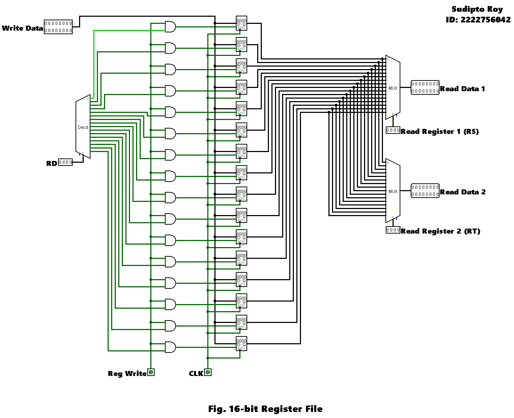

# 🔬 Lab Report 05  
## 🧪 Design and Simulation of a Register File

---

## 🎯 Objective
Design and simulate a **16-bit wide register file** for a simplified instruction set architecture (ISA). The register file must support both read and write operations, with proper control signals and selection logic.

---

## 📘 Reference: Lab Manual

The lab manual describes the design of a register file, covering:
- Concept of a register file in a CPU
- Importance of registers in instruction execution
- Instruction formats (R-type, I-type, J-type)
- Reading and writing interfacing logic
- Required inputs, outputs, and control signals

---

## 📝 Task Description
> Implement a **16-bit wide register file** that:
> 1. Stores multiple registers for general-purpose and special-purpose use.
> 2. Supports reading data from any register.
> 3. Supports writing data to any register with a **write control signal**.
> 4. Is designed according to the given ISA specification.

---

## 📜 ISA Specification

- **R-type:** `op (4 bits)` `rs (4 bits)` `rt (4 bits)` `rd (4 bits)`
- **I-type:** `op (4 bits)` `rs (4 bits)` `rt (4 bits)` `immediate (4 bits)`
- **J-type:** `op (4 bits)` `Target (12 bits)`

---

## 🔧 Design Steps

1. Define the register file structure (number of registers, bit-width).
2. Implement selection logic to choose the register to read or write.
3. Add **read ports** for outputting register contents.
4. Add a **write port** with an enable control signal.
5. Simulate and verify correct read and write functionality.

---

## 🖥️ Circuit Diagram

---

## 🧪 Simulation Result

The simulation confirmed that the register file correctly handled:
- Reading data from any specified register.
- Writing data to the selected register when the write enable signal was active.
- Maintaining data integrity across read/write cycles.

---

## 📸 Lab Manual Snapshots

Click to view images from the Lab Manual

  
  
  
  
  

---

## 📓 Lab Report Images

Click to view handwritten lab report scans

  
  
  
  
  

---

## ✅ Conclusion

The **16-bit register file** was successfully designed and simulated in Logisim. The implementation met all the given ISA requirements, supporting efficient reading and writing of data with correct control logic. This experiment improved the understanding of register-level storage and its role in CPU instruction execution.

---

